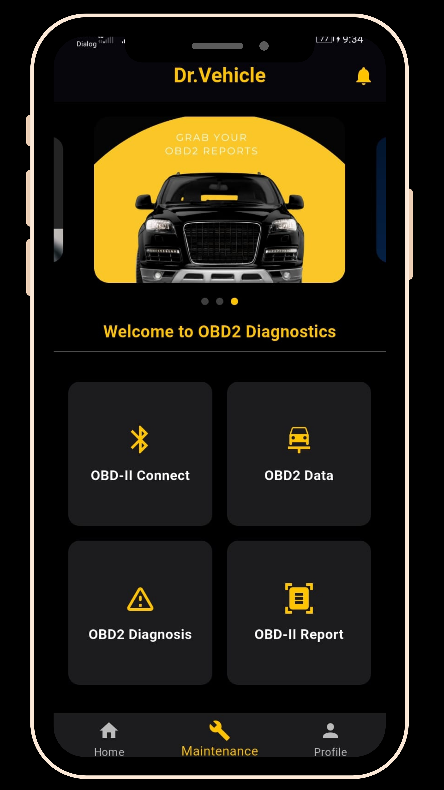

# 🚗 Dr. Vehicle – Vehicle Maintenance & Diagnosis System

Dr. Vehicle is a cross-platform mobile application developed using Flutter that helps vehicle owners track maintenance, monitor diagnostics via OBD-II, and stay informed with timely service reminders. It combines manual tracking with automated Bluetooth-based diagnostics to provide a complete overview of vehicle health Using AI Based predictions.

## 📱 Features

- 🔧 Add and manage multiple vehicle profiles
- 📅 Schedule and track service history (oil changes, tire replacement, insurance, etc.)
- 📡 Real-time engine diagnostics using OBD-II Bluetooth adapter
- ⛽ Fuel consumption and mileage tracking
- 🔔 Push notifications for upcoming services
- ☁️ Firebase-backed cloud data synchronization
- 📊 Maintenance reports and history viewer

## 🧰 Built With

- **Flutter** – UI toolkit for building natively compiled apps
- **Dart** – Programming language used with Flutter
- **Firebase Firestore** – Real-time database for user and maintenance data
- **Firebase Authentication** – Secure user login system
- **Huggingface** - Models hosting through the API
- **Bluetooth & OBD-II** – For connecting to and reading real-time vehicle data

## 🔌 OBD-II Integration

The app connects to any standard OBD-II Bluetooth device to:
- Read Diagnostic Trouble Codes (DTCs)
- Monitor real-time data like RPM, engine load, and fuel level
- Alert users to potential engine faults

## 📷 Screenshots
 
> For example:
> )
> 
> 
> > )
> 

## 🛠 Setup Instructions

1. **Clone the repo**  

git clone https://github.com/yourusername/Vehicle_maintenance.git

cd Vehicle_maintenance

2. **Install dependencies**

flutter pub get

3. **Connect Firebase**

Add your google-services.json to android/app

(Optional) Add GoogleService-Info.plist for iOS

4. **Run the app**
   
flutter run

**🤖 OBD-II Support**
Supports ELM327 Bluetooth OBD-II adapters.

Tested on popular vehicles and OBD-II hardware.

Future update: expand protocol compatibility and AI-based diagnostics.

**📈 Future Improvements**

AI-based fault prediction in realtime

Garage integration for booking appointments

**🙏 Acknowledgment**
Thanks to:

University of Plymouth and my supervisor Mr. Saranavapavan Nasiketha

Flutter and Firebase open-source communities

All testers who provided feedback

**🧑‍💻 Author**
Janith Rankelum
Undergraduate | Plymouth University
[https://www.linkedin.com/in/janith-rankelum-119080286/]
